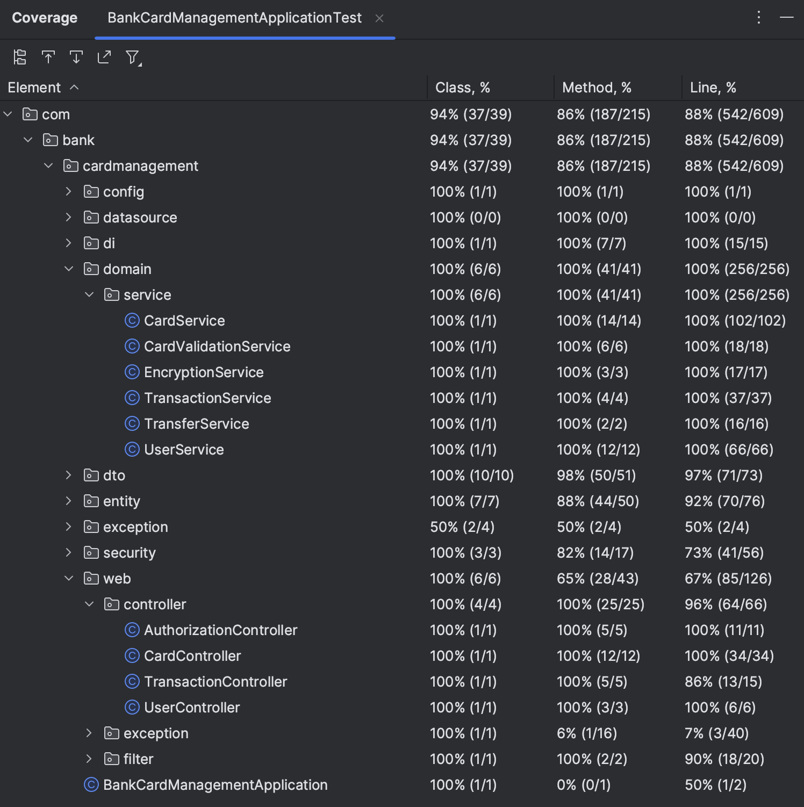
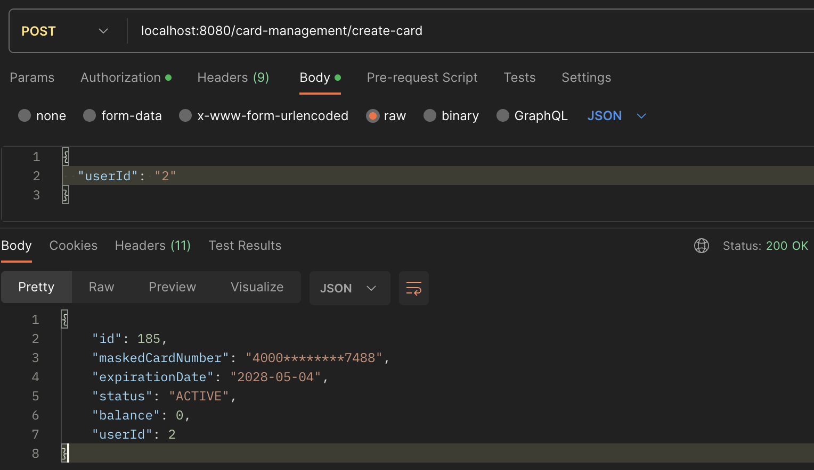

# BankCardManagmentSystems (Система управления банковскими картами)

## Содержание
1. [О проекте](#о-проекте)
2. [Особенности проекта](#особенности-проекта)
3. [Пример работы системы](#пример-работы-системы)
4. [Сборка и запуск](#сборка-и-запуск)

## О проекте

В этом проекте разработан микросервис, предоставляющий REST API для управления банковскими картами и транзакциями. Система реализует аутентификацию пользователей с использованием JWT, поддержку ролей, работу с картами, переводы и контроль лимитов на операции. 
Используемые технологии:
* Java 17 — основной язык разработки;
* Spring Boot — конфигурация и запуск микросервиса;
* Spring Web — построение REST API;
* Spring Security + JWT — реализация аутентификации и авторизации;
* Spring Data JPA (Hibernate) — работа с базой данных через ORM;
* PostgreSQL — основная база данных проекта;
* Liquibase — управление миграциями БД;
* Maven — управление зависимостями и сборкой проекта;
* Swagger (SpringDoc OpenAPI) — автоматическая генерация документации API;
* Docker + Docker Compose — контейнеризация приложения и настройка окружения для разработки;
* JUnit 5 — написание модульных и интеграционных тестов;
* Mockito — создание моков для изоляции компонентов в тестах;
* MockMvc — тестирование REST-контроллеров.

## Особенности проекта

* Все операции с картами и транзакциями реализованы через REST API с валидацией входных данных и подробной обработкой ошибок;
* Все номера карт генерируются случайным образом, при этом первые 4 цифры фиксированы. После генерации номера карты он шифруется с использованием алгоритма AES (Advanced Encryption Standard) и хранится в зашифрованном виде в базе данных. При запросах к API номер карты отображается в замаскированном виде;
* Пароли пользователей хранятся в зашифрованном виде с использованием BCrypt;
* Для управления схемой базы данных используется Liquibase. Все изменения описываются в отдельных .yaml-файлах, которые подключаются через главный файл конфигурации — db.changelog-master.yaml. При запуске приложения Liquibase автоматически применяет все изменения, указанные в этом файле, последовательно;
* Система использует три основные сущности, каждая из которых хранится в собственной таблице базы данных:
  * Пользователи (User) — содержат данные о зарегистрированных пользователях (email, пароль, роли, список карт (Card));
  * Карты (Card) — включают информацию о банковских картах: зашифрованный номер, срок действия, статус, баланс и привязку к владельцу (User), проведенные транзакции (Transaction);
  * Транзакции (Transaction) — отражают операции по картам, включая переводы и снятие средств, с указанием суммы, карты (Card), даты и типа транзакции.
* Бизнес-логика и REST-контроллеры протестированы модульными и интеграционными тестами с использованием JUnit 5, Mockito и MockMvc для обеспечения корректности работы ключевых функций:
    

     
 	
  *Покрытие бизнес-логики тестами*
 	

 
* Доступ к API ограничен ролями пользователей. В зависимости от роли (USER или ADMIN) предоставляется разный уровень доступа к функциональности:
  |  Роль | Описание |
  | :--- | :--- |
  |ADMIN/USER|Получение токена для доступа к остальным API|
  |ADMIN/USER|Обновление токена|
  |ADMIN|Создание новой карты|
  |ADMIN|Удаление карты|
  |ADMIN|Блокировка карты|
  |ADMIN|Активация карты|
  |ADMIN|Получение списка карт|
  |USER|Получение списка собственных карт|
  |ADMIN|Получение списка транзакций|
  |USER|Получение списка собственных транзакций|
  |USER|Блокировка карты|
  |ADMIN|Создание нового пользователя|
  |ADMIN|Удаление пользователя|
  |ADMIN|Установление лимитов по карте на снятие денег|
  |USER|Транзакция на снятие наличных|
  |USER|Перевод денежных средств между картами|
  
## Пример работы системы

В качестве примера создадим карту от лица ADMIN. Новую карту привяжем к пользователю с ID 2 и отправим данный номер в теле запроса по адресу `localhost:8080/card-management/create-card`. Предварительно пропишем в заголовке запроса заранее полученный access-токен администратора:

  

	  

*Создание новой карты администратором*

В теле ответа получаем информацию о новой карте: ее ID, замаксированный номер, время действия, статус, баланс и ID владельца карты.
 
## Сборка и запуск

| Команда                                          | Описание                                                                |
|--------------------------------------------------|-------------------------------------------------------------------------|
| `mvn clean package`                              | Сборка .jar-файла Spring Boot-приложения с помощью Maven                |
| `docker-compose up --build`                      | Запуск приложения с помощью Docker Compose: сборка образа, создание и запуск контейнеров, применение миграций |
| `docker-compose down`                            | Остановка и удаление контейнеров                                        |
| `mvn test`                                       | Запуск модульных и интеграционных тестов с помощью Maven                |

Тестирование API: 
  * **Swagger UI** — доступен по адресу: `http://localhost:8080/swagger-ui.html`. Здесь автоматически генерируется документация ко всем эндпоинтам, которые можно протестировать прямо в интерфейсе. Для авторизации используется access-токен, который вводится через встроенную форму;
  * **Postman** — поддерживается отправка запросов вручную или с помощью коллекции. Для защищённых маршрутов в заголовке необходимо указывать:
  `Authorization: Bearer <access_token>`. 
  Для получения access-токена отправьте POST-запрос на `http://localhost:8080/card-management/auth/login` с телом запроса в формате JSON, содержащим поля **email** и **password**.
